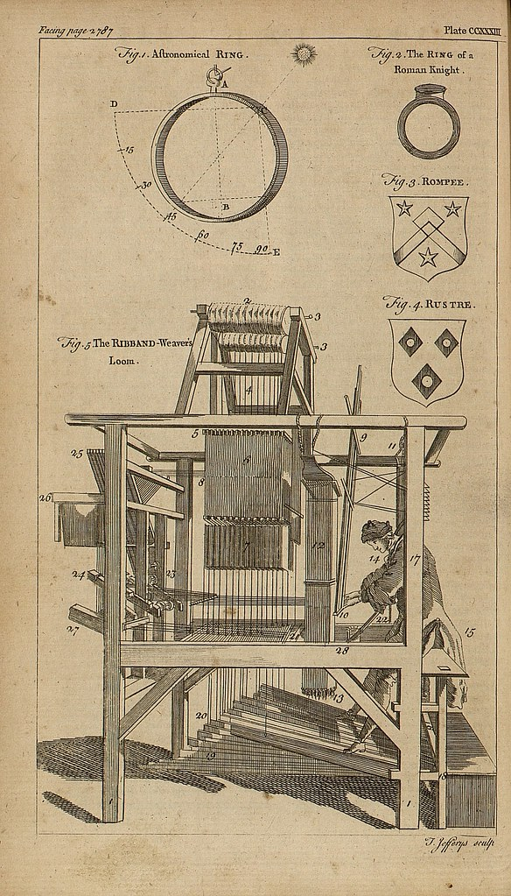

# `weaver` 🧶
🧶 Amadla Template Generator 🧶

It is simple CLI application that takes data from an entity, JSON file or a stdin and then from the templates that were
included via an entity or a direct path to a template file or directory containing multiple templates, it outputs the
generated template in a stdout or file(s).

## How it works

## 🕹️ Usage
### Help
```bash
weaver --help|-h
```

### Entity
Using a path to an entity.

#### List
Using collection name with entity name:
```bash
weaver list <collection name> <entity name>
```

Using path to an entity
```bash
weaver list <entity path>
```

#### Generate/Weave
Using collection name with entity name:
```bash
weaver <collection name> <entity name> --data|-d <file path|string>
```

Using path to an entity
```bash
weaver <entity path> --data|-d <file path|string>
```

### Template
Using a path to a template or a directory containing templates.

#### List
```bash
weaver template list <template directory path>
```

#### Generate/Weave
Outputs generate template in the same place where it is run:
```bash
weaver template <path|template directory path> --data|-d <file path|string>
```

Specify output of generate template:
```bash
weaver template <template path|template directory path> --output|-o <path> --data|-d <file path|string>
```

Print out (Stdout):
```bash
weaver template <template path|template directory path> --print|-p --data|-d <file path|string>
```

## ©️ Copyright
- "<a rel="noopener noreferrer" href="https://www.flickr.com/photos/37667416@N04/22188935455">&#039;Astronomical ring&#039; The ring of a Roman Knight, The Ribband-Weaver&#039;s Loom, Rompee, Rustre&#039;</a>" by <a rel="noopener noreferrer" href="https://www.flickr.com/photos/37667416@N04">Biblioteca Rector Machado y Nuñez</a> is marked with <a rel="noopener noreferrer" href="https://creativecommons.org/publicdomain/mark/1.0/?ref=openverse">Public Domain Mark 1.0 </a>.

## :scroll: License

The license for the code and documentation can be found in the [LICENSE](./LICENSE) file.

---

Made in Québec 🏴󠁣󠁡󠁱󠁣󠁿, Canada 🇨🇦!
